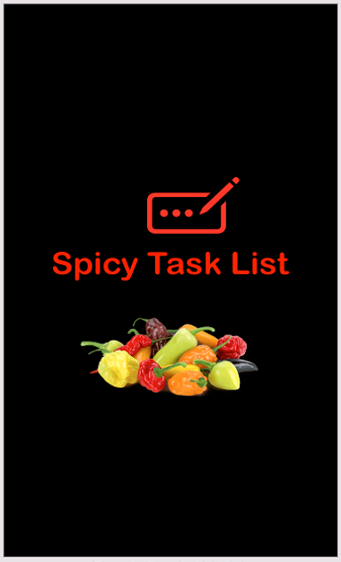
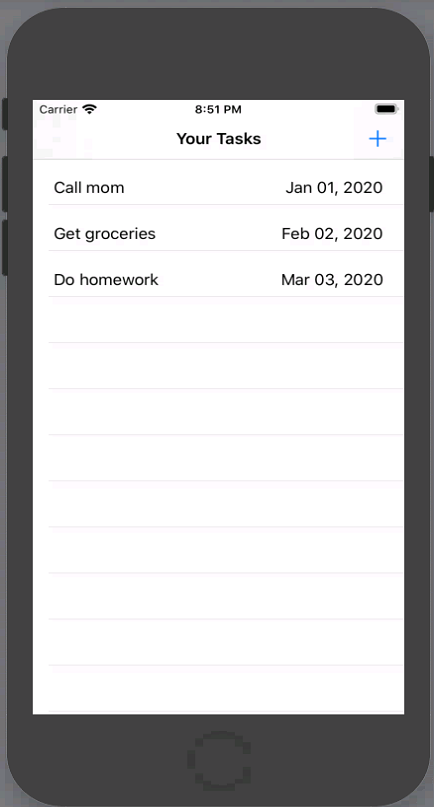
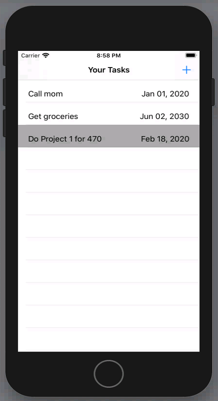
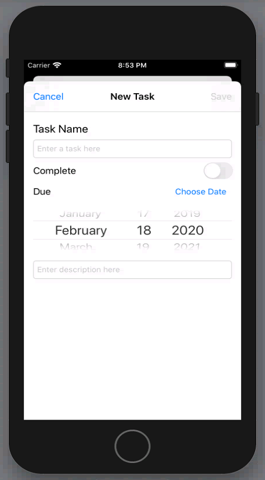
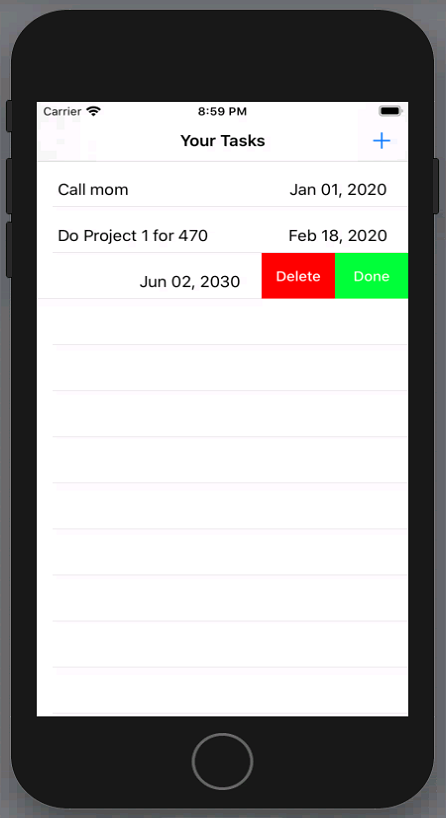
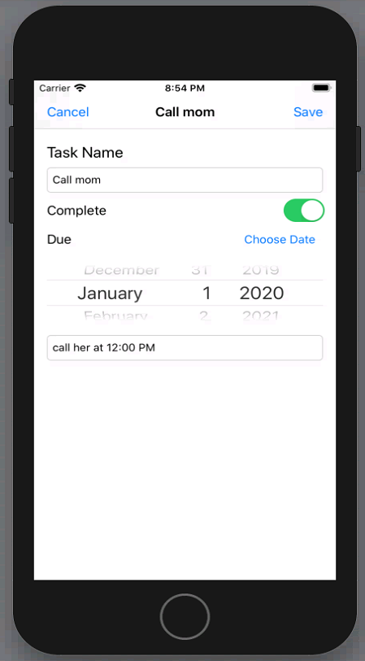
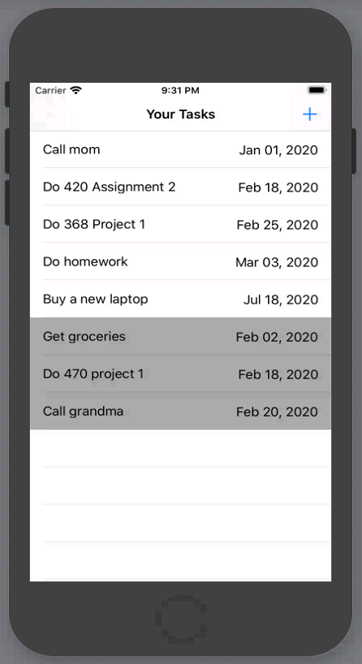

# Project 1 - iOS Task List - Fazil Shaikh
### COS 470 Spring 2020   
---

## Project Title - Spicy Task List

Get an organized overview of everything that needs to be done and never lose track of important tasks ever again. With **Spicy Task List**, you can review upcoming tasks and create new ones with ease. Features include a task name, task description, completion status, and due date to keep it simple and straightforward. The tasks are ordered by date so you always know what to prioritize. Spicy Task List helps you get stuff done! 

## Basic instructions on usage

The application loads into a list view page where all the tasks are displayed.

To create a new task:
- Click **+** on the top right
- Fill in the Task name, Completion status, Due date, and Task Description as needed.
- Press **Save** on the top right to save the task to the home page
> **Note:**  **Task name** is a required field and the rest are optional. Due date defaults to current date if it is not provided.

To edit a new task:
- Tap on the task to be edited
- Update the fields as needed.
- Press **Save** on the top right to save the task to the home page
- Alternatively, press **Cancel** to return to the home page
> **Note:**  The home page orders tasks by completion status first and then by date so the completed tasks are placed on the bottom and more recent dates are shown on the top.

Swiping a task right to left shows two buttons:
- The **Delete** button removes the task from the list
- The **Done** and **Not Done** buttons mark the task as complete or incomplete.
> **Note:**  Marking a task as complete changes its background color.

## Any special info we need to run the app

**Spicy Task List** users must pay an upfront fee of $999 for a one week trial and then an annual subscription fee is automatically charged to the user's credit card.
> **Note:**  Taxes and Convienience fee not included. Also, you will still find several unskippable advertisements per session.

In order to cancel your subscription follow the instructions below:
- You can't

## Lessons learned

From this project, I learned that swift is actually a wonderful programming language that is concise, interactive, and fun to write in. At first, Xcode gave me a lot of trouble but it was simply due to my unfamiliarity with the program. As I kept using it, the tools and features became easier to use. The task list program itself introduced me to many different built-in IOS functions which were convinient and intuitive to use. I did have to research implementation for functionality like the swipe buttons and datepicker but was able to figure it out eventually. Overall, a good first experience with Swift and Xcode.

## Screenshots

